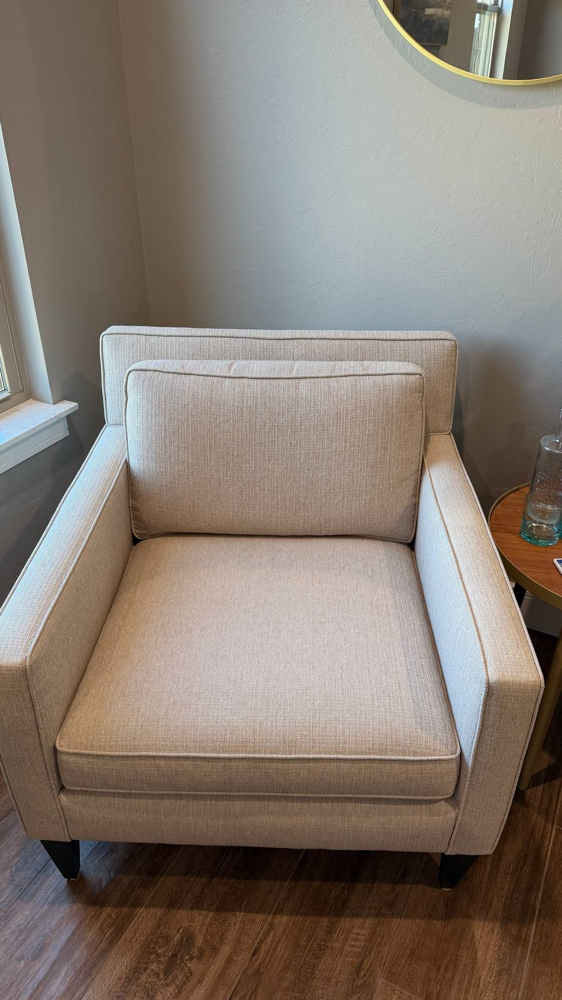
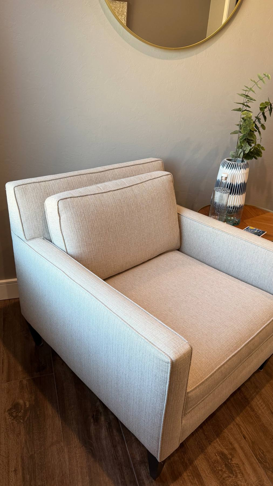

# Moving Sale Project — Claude Notes

## Folder Structure
- `index.html` — "Available Now" sale page (served via GitHub Pages at repo root)
- `tbd.html` — "TBD" items page (linked from index.html; items available just before move)
- `sold.html` — "Sold" archive page (linked from index.html and tbd.html; every item that's been marked sold lives here, not on the other two pages)
- `photos/` — all item photos, referenced from all three HTML files as `photos/filename`

## Page Structure (index.html, tbd.html, and sold.html)

The site uses the **"Porch Market"** design system: bold rounded cards, a
photo-forward grid, and pill-shaped price/status badges that overlap the
photo — designed to feel like a friendly mobile marketplace app.

### Document Head
- No external font CDN — body font is the system sans stack
  (`-apple-system, "Segoe UI", Helvetica, Arial, sans-serif`)
- All CSS is inline in a `<style>` block — no external stylesheet

### CSS Color Variables
```css
--cloud:     #EFF3EF   /* page background */
--card:      #FFFFFF   /* item card / info block background */
--charcoal:  #202A24   /* nav bg, section icons, TBD pill, sold pill, contact card bg */
--leaf:      #3F7D53   /* primary accent — Now pill, links, hero gradient, CTA button */
--leafdark:  #2E5D3E   /* hero gradient dark stop, link hover */
--coral:     #E1633D   /* price pill */
--line:      #DCE4DC   /* hairline borders */
--muted:     #6E7A70   /* secondary text (notes) */
--mutedsoft: #95A198   /* placeholder text */
```

### Hero Section
```html
<div class="hero">
  <div class="hero-inner">
    <div class="hero-eyebrow">Larry &amp; Kip's Moving Sale</div>
    <h1>Moving Sale<em>Everything Must Go</em></h1>
    <p class="hero-sub">...</p>
    <p class="hero-updated">Last updated: Month DD, YYYY</p>  <!-- UPDATE THIS -->
    <div class="hero-badges">
      <span class="badge">🟢 <span id="avail-count">0</span> available</span>
      <span class="badge">💬 Email to claim</span>
    </div>
  </div>
</div>
```
- `<h1 em>` renders as a block on its own line (not italic)
- `hero-updated` is the "Last updated" line — **always update to today's date when items change**
- `#avail-count` is filled in automatically by the inline script (counts
  `.item-card:not(.sold)`) — never hardcode this number

### Instructions Blocks (between hero and container)
- Two rounded white cards floating just below the hero: one explaining how the sale works (links to tbd.html), one with contact info (kipnlar@gmail.com, Zelle/Cash). Class `sage` on the second just tints it slightly green — it no longer means "left border."

### Category Filter Chips
A horizontally-scrollable chip bar sits between the info blocks and the
sections. Clicking a chip shows only the matching `.section[data-cat]`;
"All" shows everything. Chips and section `data-cat` values must match:
```html
<div class="cat-bar">
  <div class="cat-chip active" data-cat="all">All</div>
  <div class="cat-chip" data-cat="appliances">🍳 Appliances</div>
  <!-- one chip per section, same order as the sections below -->
</div>
```
The filtering logic lives in the inline `<script>` at the bottom of the
page and needs no changes when items/sections are added — only when a
whole new section is introduced (add both the chip and the section's
`data-cat`).

### Sections (inside `<div class="container">`)
Current sections in `index.html`, in order, each with icon, title, and a `data-cat` matching its chip:
1. 🍳 Appliances (`appliances`)
2. 🛋️ Furniture (`furniture`)
3. 🖼️ Accessories & Décor (`decor`)
4. 🔧 Miscellaneous (`misc`)
5. 🎄 Holiday Décor (`holiday`)

tbd.html only has Appliances / Furniture / Miscellaneous chips+sections.

`sold.html` has no cat-bar/chips — it's a single flat "🏷️ Sold Items" section
(no `data-cat`) holding every sold item from across the site. When an item on
index.html or tbd.html sells, move its card here rather than leaving it in
place with a `sold` class.

Section HTML pattern:
```html
<div class="section" data-cat="appliances">
  <div class="section-header">
    <div class="section-icon">🍳</div>
    <h2 class="section-title">Appliances</h2>
    <div class="section-line"></div>
  </div>
  <div class="items-grid">
    <!-- item cards go here -->
  </div>
</div>
```

### Item Card Anatomy
Full example with all optional elements:
```html
<div class="item-card">                          <!-- add "sold" class if sold -->
  <!-- Option A: single photo -->
  <div class="item-photo">
    
  </div>
  <!-- Option B: multi-photo (2-column grid) -->
  <div class="item-photo multi">
    
    
  </div>
  <!-- Option C: no photo yet -->
  <div class="item-photo-placeholder">Photo coming soon</div>

  <div class="item-body">
    <!-- Name: plain text or wrapped in <a> for external link -->
    <div class="item-name">Item Name Here</div>
    <div class="item-name"><a href="https://..." target="_blank">Item with Link</a></div>

    <!-- Optional note (italic, smaller, gray) -->
    <div class="item-note">Originally $1,199</div>

    <div class="item-footer">
      <div class="item-price">$500</div>
      <!-- OR for TBD price: -->
      <div class="item-price tbd-price">Price TBD</div>

      <span class="when-pill when-now">Now</span>
      <!-- OR: -->
      <span class="when-pill when-tbd">TBD</span>
    </div>
  </div>
</div>
```
This markup is unchanged from before, but note how CSS now repositions two
of these pieces purely visually (no HTML changes needed when adding items):
- `.item-footer` is reordered (`order:-1`) and pulled up with a negative
  margin so the coral `.item-price` pill overlaps the bottom edge of the
  photo, even though in the markup it comes after the name/note.
- `.when-pill` is `position:absolute` to the card's top-right corner, so it
  reads as a badge over the photo regardless of where it sits in the DOM.

### Sold Items
```html
<!-- Basic sold -->
<div class="item-card sold">

<!-- Sold with buyer initials shown in badge -->
<div class="item-card sold" data-sold-to="MB">
```
- Sold cards get reduced opacity (0.5), pointer-events: none, and a dark rounded "Sold" pill (top-right, replaces the when-pill)
- `data-sold-to` appends " · {initials}" to the Sold badge via CSS `attr()`
- The `.when-now`/`.when-tbd` pill is hidden on sold cards (`.item-card.sold .when-pill { display:none; }`) so it doesn't clash with the Sold badge
- **Sold items live on `sold.html`, not on `index.html`/`tbd.html`.** When an
  item sells, cut its card from wherever it was, add the `sold` class (and
  `data-sold-to` if known), and paste it into the `.items-grid` in
  `sold.html`'s single section. Don't leave `sold`-classed cards sitting in
  the Appliances/Furniture/etc. sections on the other two pages.

### Photo Conventions
- **Single-photo items**: two separate files — a smaller thumbnail (`src`) and a larger full-size (`data-large-src`). Extracted photos use sequential numbering where odd = full-size, even = thumbnail (e.g., photo_1 = large, photo_2 = thumb). This is just how they ended up — new photos can use any filename.
- **Multi-photo items**: same file used for both `src` and `data-large-src` (one file per angle, no separate thumbnail)
- Named photos (from knowledge/photos/): `steamcleaner.jpg`, `PlasticGlasses1.jpeg`, `PlasticGlasses2.jpeg`, `IMG_1171.jpeg`, etc. — these are used directly by descriptive name
- Auto-extracted photos: `photo_1.jpeg` through `photo_89.jpeg`
- New photos added manually: use descriptive names (e.g., `PatioRug1.jpeg`)

### Lightbox
- Clicking any `.item-photo img[data-large-src]` opens a full-screen overlay
- Opens `data-large-src` value as the full-size image
- Closes via: Escape key, clicking overlay, clicking image, or ✕ button
- JavaScript is inline at the bottom of `<body>`, no changes needed when adding items

### Contact Footer
```html
<div class="contact-strip">
  <div class="contact-card">
    <h2>Interested in Something?</h2>
    <p>...</p>
    <a class="email-link" href="mailto:kipnlar@gmail.com">kipnlar@gmail.com</a>
    <p class="payment-note">Payment via <strong>Zelle</strong> or <strong>Cash</strong> · Buyer pickup at our home</p>
  </div>
</div>
```
The dark rounded `.contact-card` is the visual block; `.contact-strip` is just a max-width wrapper.

## Key Conventions
- Prices: `$75`, `$1,400` (dollar sign, commas for thousands)
- "Now" items: `when-now` pill (leaf green)
- "TBD" items: `when-tbd` pill (dark charcoal), `tbd-price` class on price div if price unknown
- Multi-photo: `class="item-photo multi"` — 2-column grid, imgs 150px tall
- Single-photo: `class="item-photo"` — full width, imgs 190px tall

## Workflow for Adding New Items
1. Add photo files to `photos/` at the repo root
2. In the appropriate section in `index.html` (or `tbd.html`), add an item card following the anatomy above
3. Reference photos as `src="photos/filename.jpeg"` and `data-large-src="photos/filename.jpeg"`
4. Update the "Last updated" date in the hero section to today's date
5. If the item belongs to a brand-new section (not one of the existing categories), add both a new `.section[data-cat="..."]` block and a matching `.cat-chip[data-cat="..."]` in the `.cat-bar` — the two `data-cat` values must match exactly, or the filter chip won't show that section

## Workflow for Marking an Item Sold
1. Find the item's card in `index.html` or `tbd.html` and remove it from that page entirely
2. Paste the same card into the `.items-grid` in `sold.html`, adding the `sold` class (and `data-sold-to="XX"` if you know the buyer's initials)
3. Update the "Last updated" date in the hero section of whichever page(s) you edited (including `sold.html`)

## Important: Last Updated Date
Always update this line in the hero section when any item is added, removed, or changed:
```
Last updated: Month DD, YYYY
```

## Git
- Always commit to the main branch
